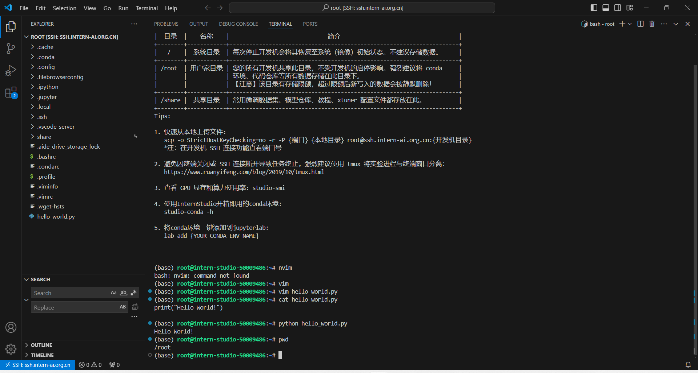

# L0-Linux 闯关

## 任务

|            | 任务描述                                      | 完成所需时间 |
| ---------- | --------------------------------------------- | ------------ |
| 闯关任务   | 完成SSH连接与端口映射并运行`hello_world.py`   | 10min        |
| 可选任务 1 | 将Linux基础命令在开发机上完成一遍             | 10min        |
| 可选任务 2 | 使用 VSCODE 远程连接开发机并创建一个conda环境 | 10min        |
| 可选任务 3 | 创建并运行`test.sh`文件                       | 10min        |

[文档链接](https://github.com/InternLM/Tutorial/blob/camp3/docs/L0/Linux/readme.md)

## 完成SSH连接与端口映射并运行`hello_world.py`

在开发机运行

## 使用 VSCODE 远程连接开发机并创建一个conda环境

## 创建并运行`test.sh`文件

创建 `test.sh`，用 `export` 子命令导出 `name` 环境，导出的 `name` 环境信息在 `name.yml` 中。

删除原有的 `name` 环境。

用 `test.sh` 的 `restore` 子命令恢复 `name` 环境。

重新激活 `name` 环境。

