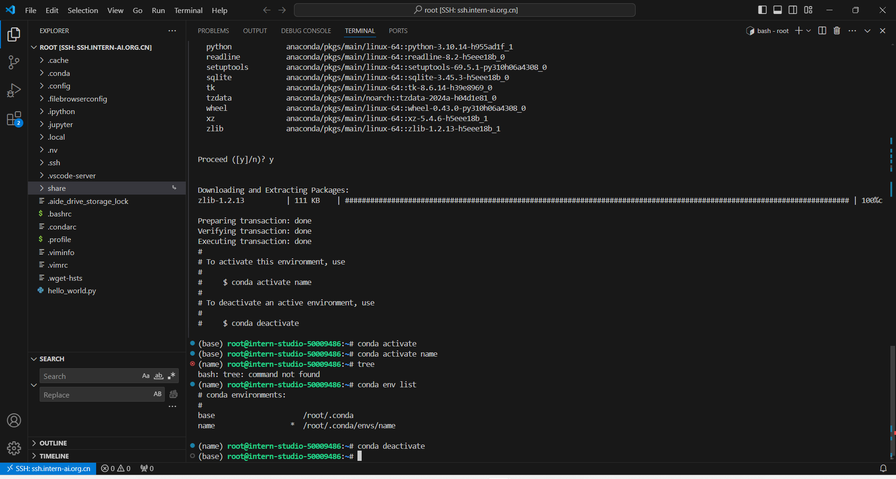
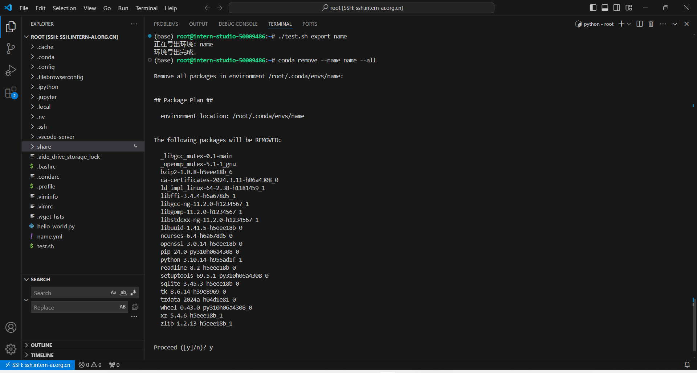
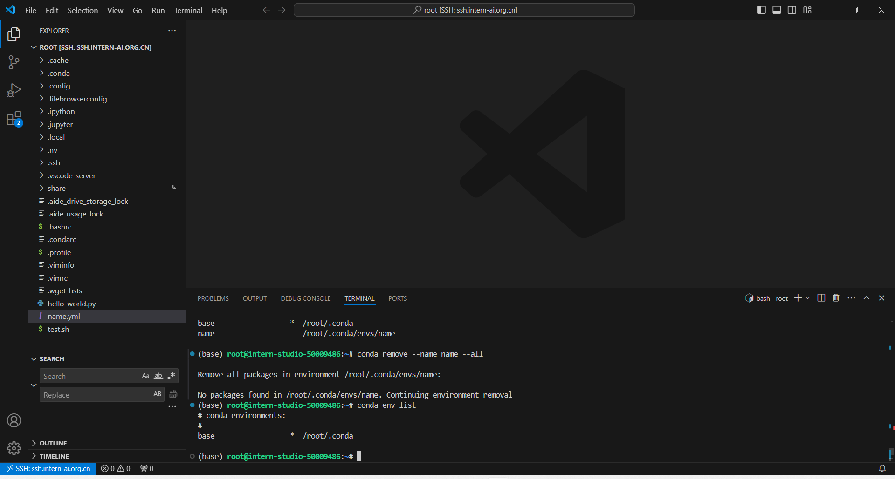
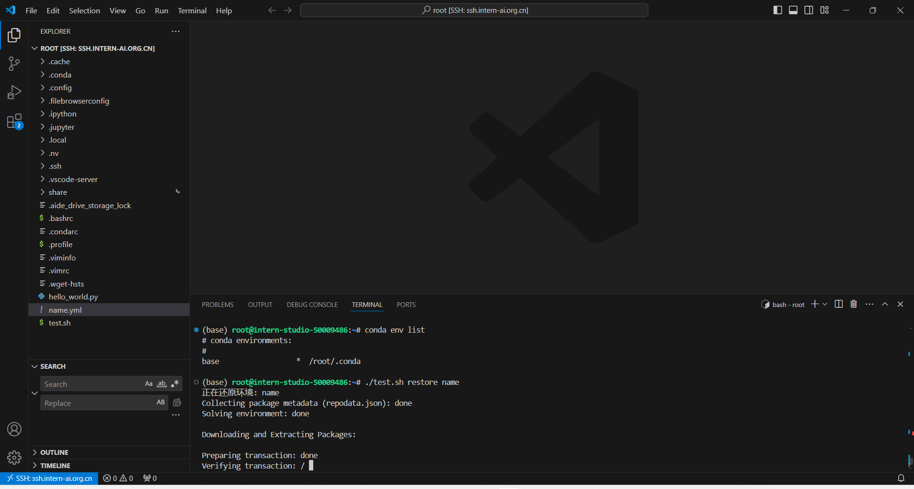
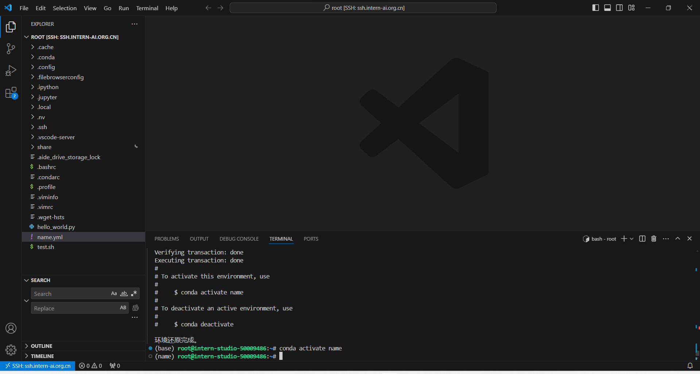

# L0-Linux 闯关

## 任务

|            | 任务描述                                      | 完成所需时间 |
| ---------- | --------------------------------------------- | ------------ |
| 闯关任务   | 完成SSH连接与端口映射并运行`hello_world.py`   | 10min        |
| 可选任务 1 | 将Linux基础命令在开发机上完成一遍             | 10min        |
| 可选任务 2 | 使用 VSCODE 远程连接开发机并创建一个conda环境 | 10min        |
| 可选任务 3 | 创建并运行`test.sh`文件                       | 10min        |

[文档链接](https://github.com/InternLM/Tutorial/blob/camp3/docs/L0/Linux/readme.md)

## 完成SSH连接与端口映射并运行`hello_world.py`

首先将开发机通过 SSH 端口映射到本地 VS Code，命令如下。

```bash
ssh -p 48512 root@ssh.intern-ai.org.cn -o StrictHostKeyChecking=no -o UserKnownHostsFile=/dev/null
```

创建文件 `~/hello_world.py` 并写入以下内容。

```python
import socket
import re
import gradio as gr
 
# 获取主机名
def get_hostname():
    hostname = socket.gethostname()
    match = re.search(r'-(\d+)$', hostname)
    name = match.group(1)
    
    return name
 
# 创建 Gradio 界面
with gr.Blocks(gr.themes.Soft()) as demo:
    html_code = f"""
            <p align="center">
            <a href="https://intern-ai.org.cn/home">
                
            </a>
            </p>
            <h1 style="text-align: center;">☁️ Welcome {get_hostname()} user, welcome to the ShuSheng LLM Practical Camp Course!</h1>
            <h2 style="text-align: center;">😀 Let’s go on a journey through ShuSheng Island together.</h2>
            <p align="center">
                <a href="https://github.com/InternLM/Tutorial/blob/camp3">
                    
                </a>
            </p>

            """
    gr.Markdown(html_code)

demo.launch()
```

安装 gradio 模块。

```bash
pip install gradio
```

等待下载完成后，运行 `~/hello_world.py`


运行后，gradio 在本地 `http://127.0.0.1:7860` 创建了网页，通过本地浏览器打开，页面如下。


## 使用 VSCODE 远程连接开发机并创建一个conda环境



## 创建并运行`test.sh`文件

创建 `test.sh`，用 `export` 子命令导出 `name` 环境，导出的 `name` 环境信息在 `name.yml` 中。



删除原有的 `name` 环境。



用 `test.sh` 的 `restore` 子命令恢复 `name` 环境。



重新激活 `name` 环境。


