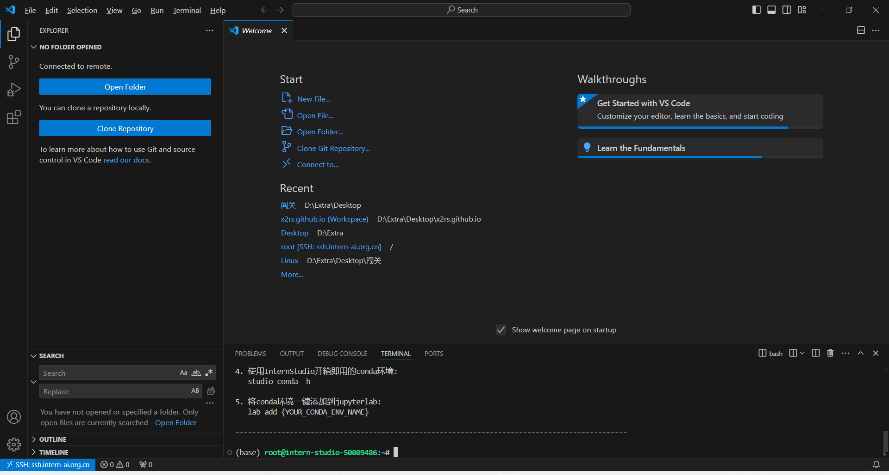
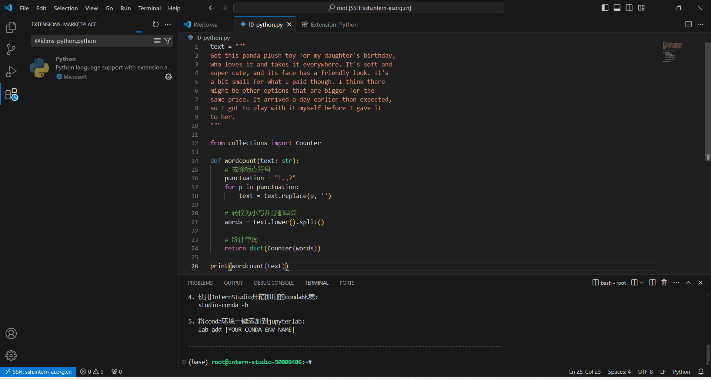
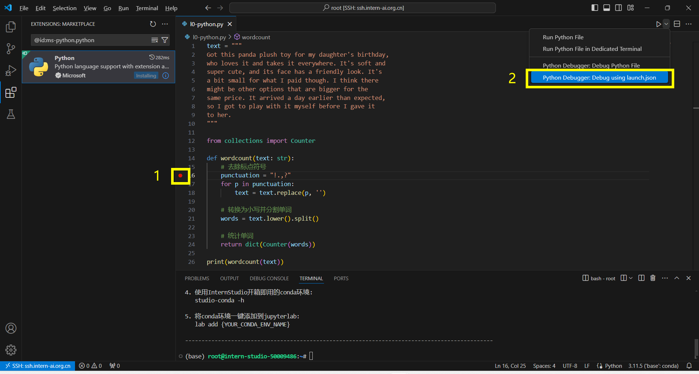
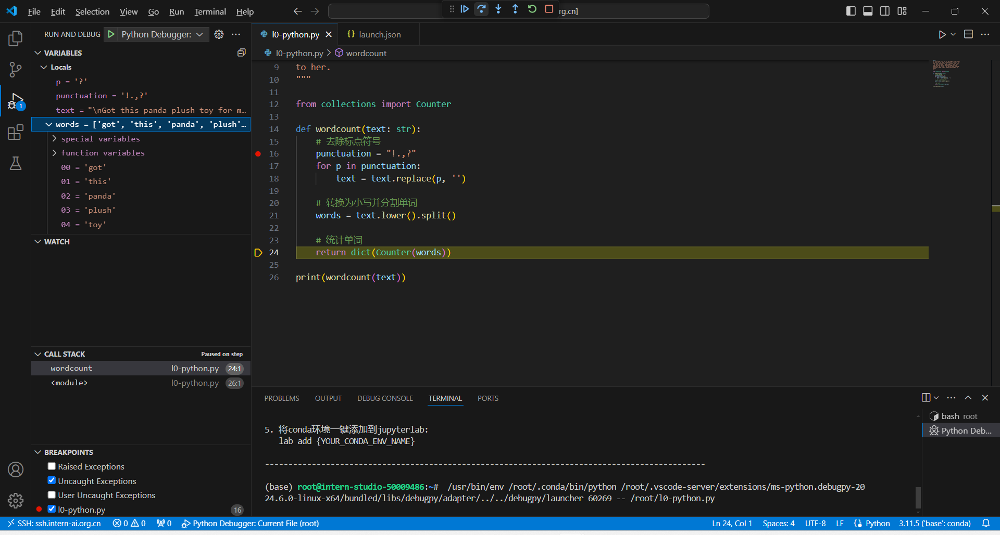
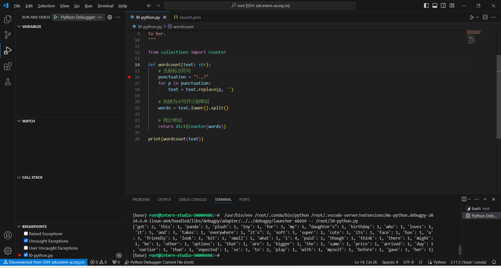

# L0 Python 闯关

[文档链接](https://github.com/InternLM/Tutorial/blob/camp3/docs/L0/Python/task.md)

## 任务概览

| 任务类型 | 任务内容                         | 预计耗时 |
| -------- | -------------------------------- | -------- |
| 闯关任务 | Python实现wordcount              | 15mins   |
| 闯关任务 | Vscode连接InternStudio debug笔记 | 15mins   |

## 任务一

请实现一个wordcount函数，统计英文字符串中每个单词出现的次数。返回一个字典，key为单词，value为对应单词出现的次数。

Eg:

Input:

```python
"""Hello world!  
This is an example.  
Word count is fun.  
Is it fun to count words?  
Yes, it is fun!"""
```

Output:

```python
{'hello': 1,'world!': 1,'this': 1,'is': 3,'an': 1,'example': 1,'word': 1, 
'count': 2,'fun': 1,'Is': 1,'it': 2,'to': 1,'words': 1,'Yes': 1,'fun': 1  }
```

TIPS：记得先去掉标点符号，然后把每个单词转换成小写。不需要考虑特别多的标点符号，只需要考虑实例输入中存在的就可以。

### 任务一解答

```python title="wordcount.py"
--8<-- "docs/internlm/l0-python/wordcount.py"
```

## 任务二

请使用本地vscode连接远程开发机，将上面你写的wordcount函数在开发机上进行debug，体验debug的全流程，并完成一份debug笔记(需要截图)。

### 任务二解答

本地vscode用ssh连接远程开发机。



打开 `/root/` 目录，创建 `l0-python.py` 文件，写入任务一解答的内容；此时 VS Code 会提示下载 Python 扩展，下载扩展即可。



下载完扩展后，设置断点，开始调试。



选择 Python Debugger: Debug using launch.json 会在 `~/.vscode/` 目录下生成 `launch.json` 配置文件，内容如下：

```json title="launch.json"
--8<-- "docs/internlm/l0-python/launch.json"
```

进入 Python 调试后，用上方的按钮进行 Continue，Step Over 等操作；左侧出现 VARIABLES 视图，显示局部和全局变量。



调试结束，输出结果。

