# 1 书生·浦语大模型全链路开源体系

[视频教程](https://www.bilibili.com/video/BV1Rc411b7ns)

## 大模型成为发展通用人工智能的重要途径

- 专用模型：针对特定任务，一个模型解决一个问题

- 通用大模型：一个模型应对多种任务、多种模态

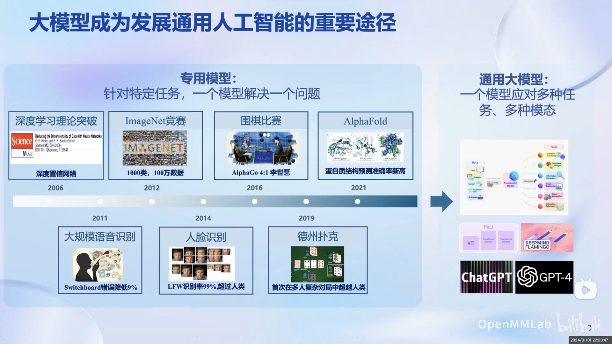

## 书生·浦语大模型系列

### 轻量级：`InternLM-7B`
- 70亿模型参数，小巧轻便，便于部署
- 10000亿训练token数据，信息全面，能力多维
- 具备长语境能力，支持8k语境窗口长度
- 具备通用工具调用能力，支持多种工具调用模板

社区低成本可用最佳模型规模
### 中量级：`InternLM-20B`
- 200亿参数量，在模型能力与推理代价间取得平衡
- 采用深而窄的结构，降低推理计算量但提高了推理能力
- 4k训练语境长度，推理时可外推至16k

商业场景可开发定制高精度较小模型规模
### 重量级：`InternLM-123B`
- 1230亿模型参数，强大的性能
- 具备极强的推理能力、全面的知识覆盖面、超强理解能力与对话能力
- 准确的API调用能力，可实现各类Agent

通用大语言模型能力全面覆盖千亿模型规模

## 书生·浦语20B开源大模型性能

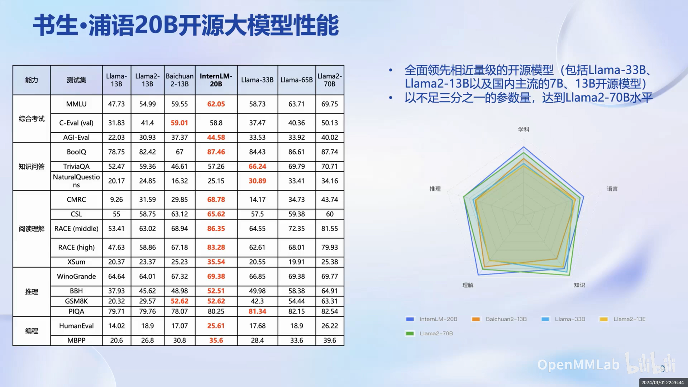

## 从模型到应用

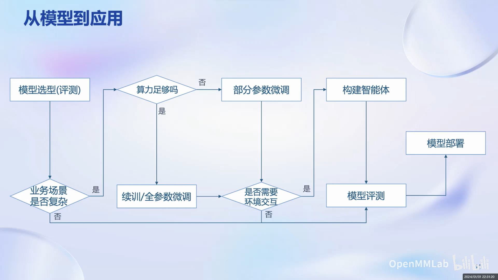

## 全链条开源开放体系

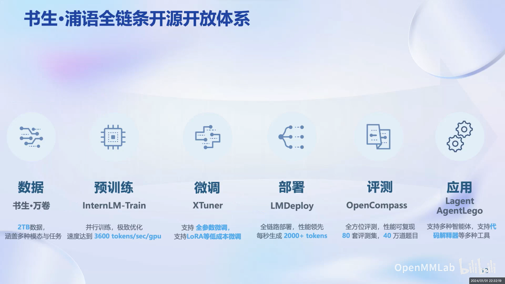

### 数据

- 书生万卷
- [OpenDataLab](https://opendatalab.com/)

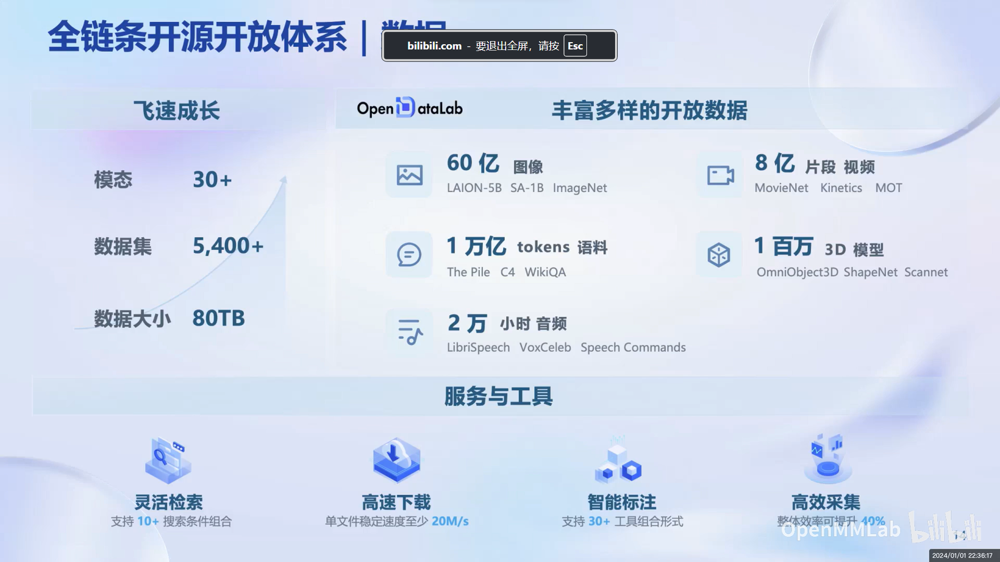

### 预训练

### 微调

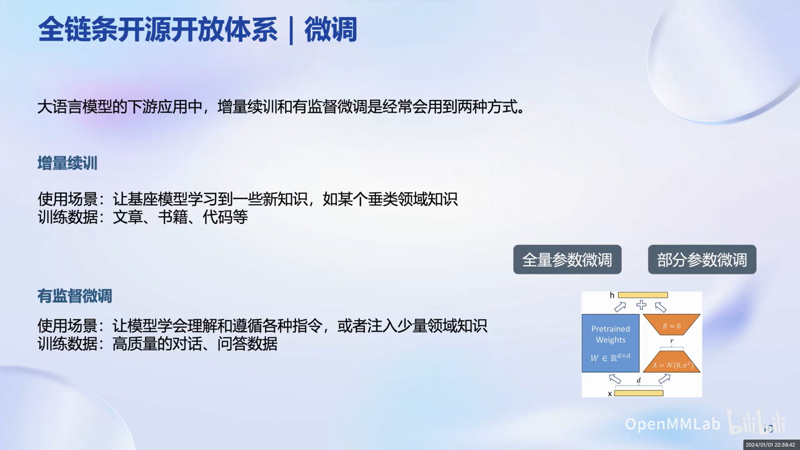

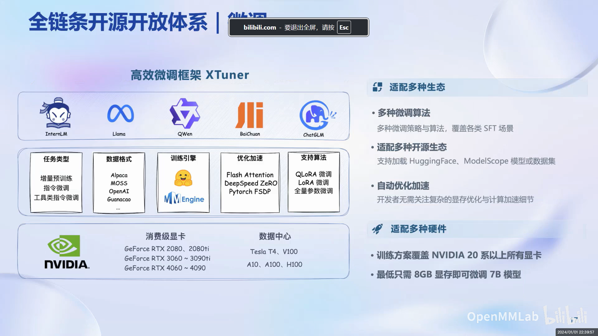

#### LoRA微调

含义：通过在模型的现有权重矩阵中添加低秩矩阵来调整模型，可以在增加少量计算负担的情况下有效调整模型。

优点：

- 只需要添加少量参数，参数效率高；
- 资源利用少且训练周期较短

#### 全参微调

含义：对预训练模型的所有参数进行调整获得新模型。

优点：

- 可以对模型进行全面的调整，使其更好地适应新任务；
- 在有足够数据和计算资源的情况下，更可能达到更优的性能。

### 评测

- [OpenCampass](https://opencompass.org.cn/home)

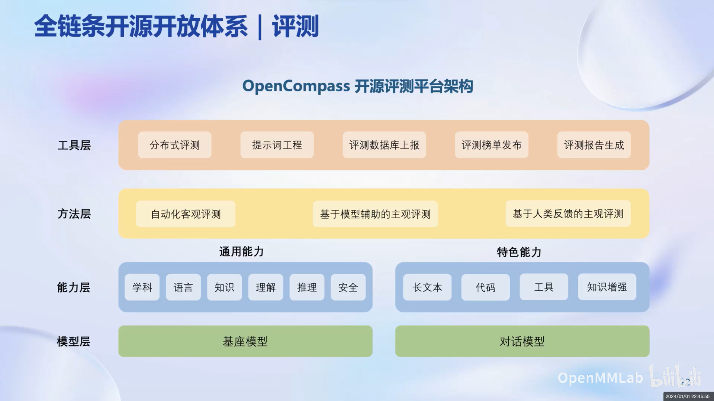

### 部署

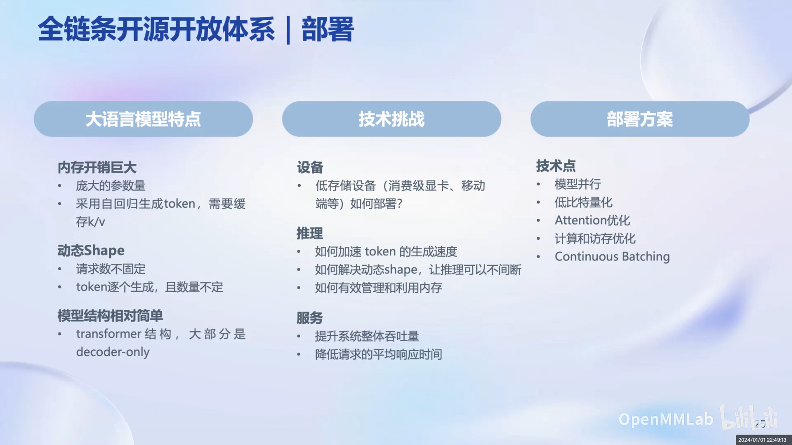

- LMDeploy

### 智能体

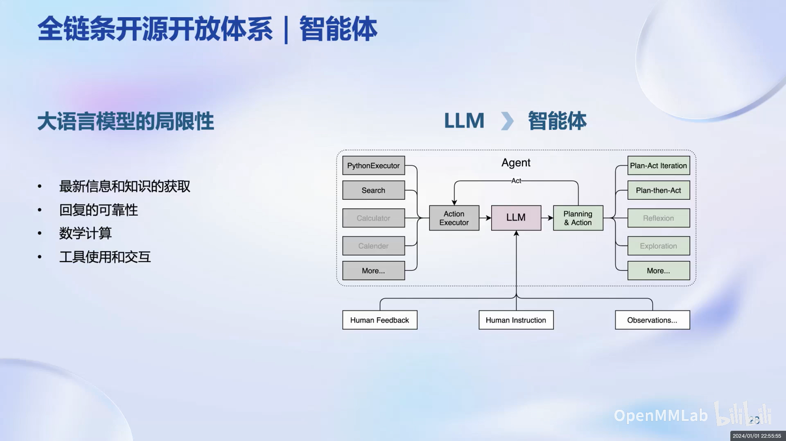

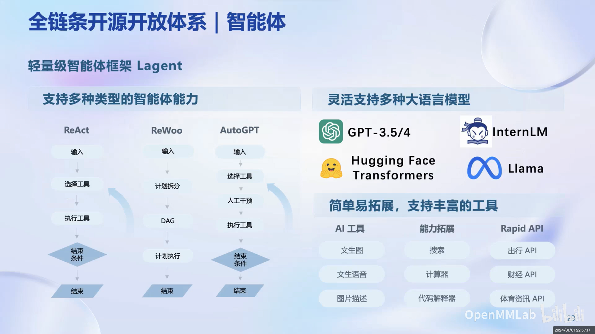

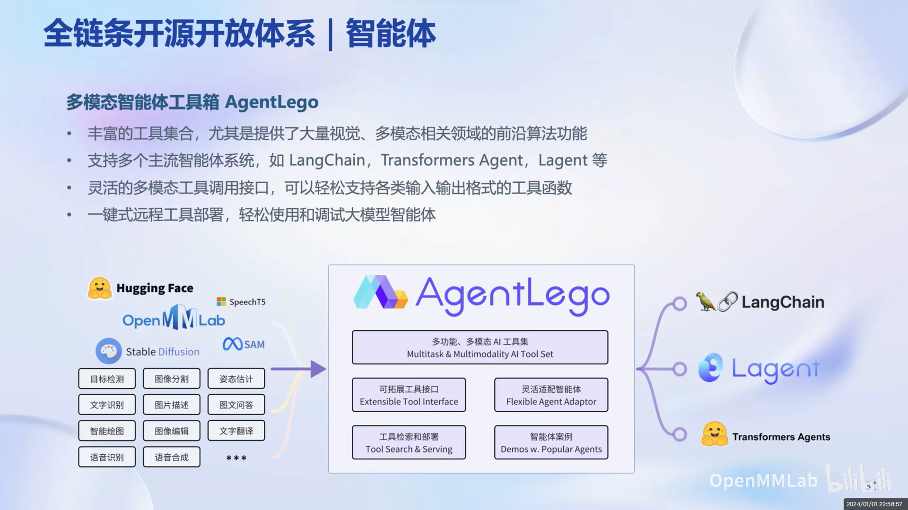

# References

[视频教程](https://www.bilibili.com/video/BV1Rc411b7ns)

[GLM接口文档](https://open.bigmodel.cn/dev/howuse/finetuning)