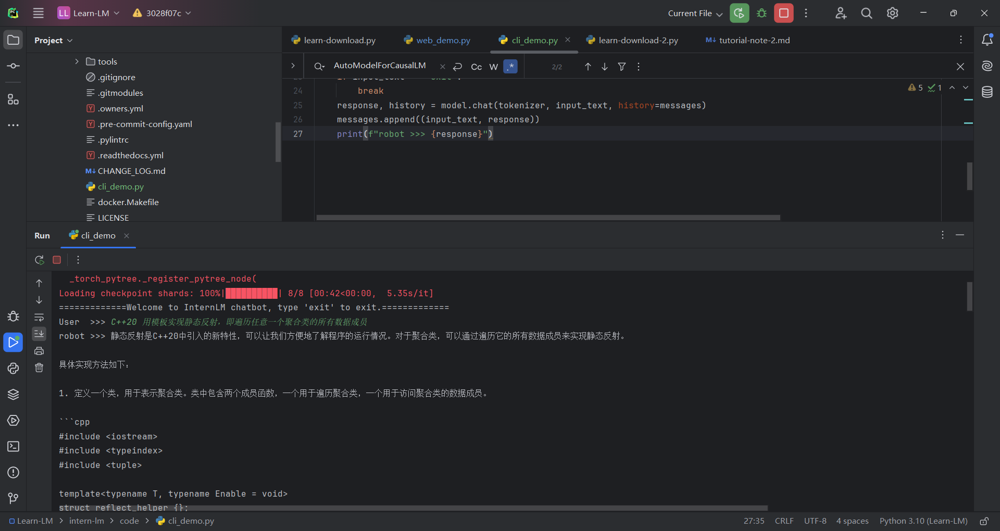

# InternLM-Chat-7B 生成C++代码测试

我最近在本地`Windows 11`环境部署了`InternLM-Chat-7B`，但是由于本地计算资源有限，每次调用的等待时间极高。对于简短的输出，大约需要等待10分钟，而对于较长的输出，可能需要长达两小时的时间。



输入

=============Welcome to InternLM chatbot, type 'exit' to exit.=============
User  >>> C++20 用模板实现静态反射，即遍历任意一个聚合类的所有数据成员
robot >>> 静态反射是C++20中引入的新特性，可以让我们方便地了解程序的运行情况。对于聚合类，可以通过遍历它的所有数据成员来实现静态反射。

具体实现方法如下：

1. 定义一个类，用于表示聚合类。类中包含两个成员函数，一个用于遍历聚合类，一个用于访问聚合类的数据成员。

```cpp
#include <iostream>
#include <typeindex>
#include <tuple>

template<typename T, typename Enable = void>
struct reflect_helper {};

template<typename T>
struct reflect_helper<T, typename std::enable_if<std::is_base_of<Aggregate, T>::value>::type>
{
public:
    static auto reflect(T& obj) -> decltype(obj.get_members())
    {
        return reflect_helper(obj);
    }
private:
    static auto get_members() -> std::tuple<
        std::type_index,
        reflect_helper<T, std::enable_if<!std::is_base_of<Aggregate, T>::value>::type::get_members
    >
    {
        std::make_tuple(
            std::type_index(typeid(T)),
            get_members()
        );
    }
};
template<typename T>
struct reflect_helper<T, typename std::enable_if<std::is_base_of<Aggregate, T>::value>::type>
{
public:
    static auto reflect(T& obj) -> decltype(obj.get_members())
    {
        return reflect_helper<T, std::enable_if<!std::is_base_of<Aggregate, T>::value>::type>::reflect(obj);
    }
private:
    static auto get_members() -> std::tuple<
        std::type_index,
        reflect_helper<T, std::enable_if<!std::is_base_of<Aggregate, T>::value>::type::get_members
    >
    {
        std::make_tuple(
            std::type_index(typeid(T)),
            get_members()
        );
    }
};
```

2. 定义一个类，用于表示聚合类。类中包含一个虚函数`get_members()`，用于返回聚合类的数据成员。

```cpp
class Aggregate {
public:
    virtual std::tuple<std::type_index, reflect_helper<Aggregate, std::enable_if<!std::is_base_of<Aggregate, Aggregated>::value>::type::get_members> get_members() const = 0;
};
```

3. 定义一个类，用于表示聚合类。类中包含数据成员，并且继承自`Aggregate`。类中实现`get_members()`函数即可。

```cpp
template<typename T>
class Aggregated : public Aggregate
{
public:
    T data;
    Aggregated() = default;
    Aggregated(const T& data) : data(data) {}
    Aggregated(const T& data, const std::type_index& index, std::tuple<std::type_index, reflect_helper<Aggregated, std::enable_if<!std::is_base_of<Aggregated, Aggregated>::value>::type::get_members> reflect) :
        Aggregate(), data(data) {}
    std::tuple<std::type_index, reflect_helper<Aggregated, std::enable_if<!std::is_base_of<Aggregated, Aggregated>::value>::type::get_members> get_members() const override
    {
        return std::tuple<std::type_index, reflect_helper<Aggregated, std::enable_if<!std::is_base_of<Aggregated, Aggregated>::value>::type::get_members>{
            std::type_index(index), reflect_helper<Aggregated, std::enable_if<!std::is_base_of<Aggregated, Aggregated>::value>::type::reflect(data)};
    }
};
```

4. 测试程序。

```cpp
#include <iostream>
#include <typeinfo>

template<typename T, typename Enable = void>
struct reflect_helper {};

template<typename T>
struct reflect_helper<T, typename std::enable_if<std::is_base_of<Aggregate, T>::value>::type>
{
public:
    static auto reflect(T& obj) -> decltype(obj.get_members())
    {
        return reflect_helper<T, std::enable_if<!std::is_base_of<Aggregate, T>::value>::type>::reflect(obj);
    }
private:
    static auto get_members() -> std::tuple<
        std::type_index,
        reflect_helper<T, std::enable_if<!std::is_base_of<Aggregate, T>::value>::type::get_members
    >
    {
        std::make_tuple(
            std::type_index(typeid(T)),
            get_members()
        );
    }
};

int main()
{
    Aggregate* obj = new Aggregate();
    Aggregated<int> *agg = new Aggregated<int>(42);
    obj->add_data(agg);
    std::tuple<std::type_index, std::string> result = reflect(obj);
    std::cout
}
```