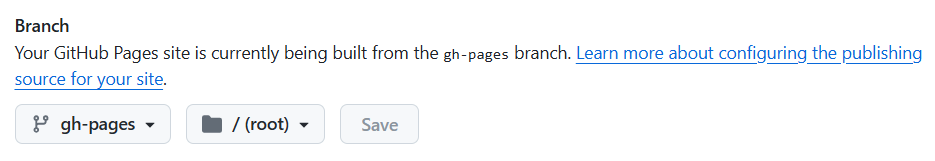

# 从零开始的 mkdocs-material Github Pages 建站教程

mkdocs要在Python中下载，请确保你已安装Python。

## 配置Github Pages

1. [注册](https://github.com/signup)一个Github账号。

2. 根据官方文档，仅进行[创建网站](https://docs.github.com/zh/pages/quickstart#creating-your-website)章节的操作，要注意的是，在“生成和部署”的“分支”下，先不要选择发布源。

3. 在 `Settings->Actions->General->Workflow permissions` 中，选择 `Read and write permissions`

4. 在仓库的 `main` 分支中，创建以下文件：

- `mkdocs.yml`

- `docs/index.md`

5. 打开 `Settings->Pages`，选择 `master branch` 作为发布源，然后点击 `Save`。

## 本地用 mkdocs-material 测试

1. [安装](https://squidfunk.github.io/mkdocs-material/getting-started/)mkdocs-material

