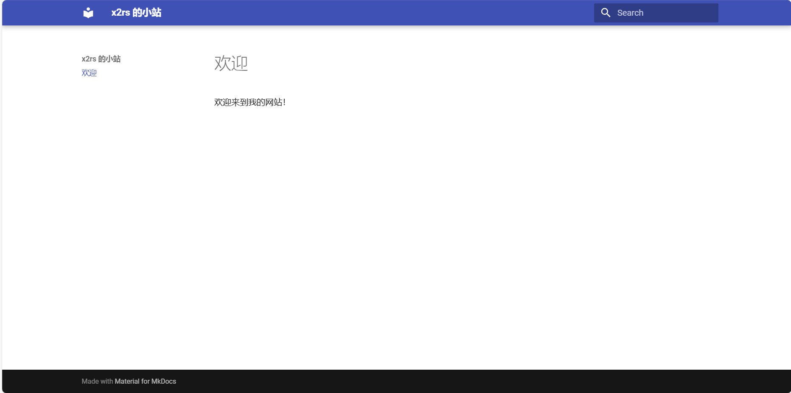
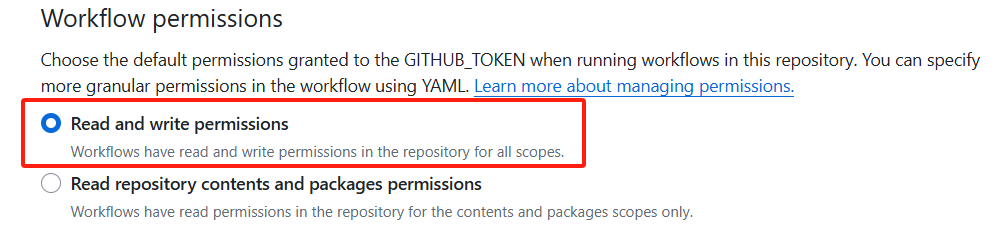
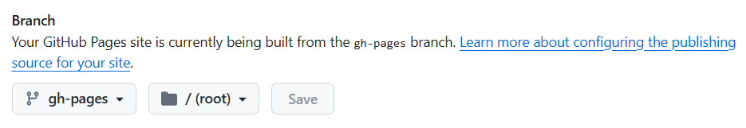

# 用 Material for MkDocs 和 GitHub Pages 搭建静态博客

如你所见，**x2rs的小站**使用 Material for MkDocs 搭建，本教程可以从一个 Python 环境开始，搭建一个能用链接访问的静态博客。在食用本教程之前，请确保你安装了 Python3。如果没有安装 Python3，可以去[官网](https://www.python.org/downloads/)下载安装。

本教程参考 [Material for MkDocs 的官方文档](https://squidfunk.github.io/mkdocs-material/)，若内容有冲突，以官方文档为准。

下面是官方对 Material for MkDocs 的介绍。^[1]

> Material for MkDocs 是建立在 MkDocs 之上的一个强大的文档框架，MkDocs 是一个用于项目文档的静态站点生成器。如果您熟悉 Python，您可以使用 pip，Python 的包管理器来安装 Material for MkDocs。如果不熟悉，我们建议使用 docker。

## 下载Material for MkDocs

打开一个终端，下载 Material for MkDocs：

```bash
pip install mkdocs-material
```

注意：如果你对 Python 不熟，我建议你了解一下 pip 的用法。

## 创建配置文件

安装 Material for MkDocs 之后，你可以使用 mkdocs 可执行文件来引导启动你的项目文档。用 cd 命令转到你希望项目所在的目录，并输入下方命令。

```
mkdocs new .
```

此时目录结构为：

``` { .sh .no-copy }
.
├─ docs/
│  └─ index.md
└─ mkdocs.yml
```

`mkdocs.yml` 是 MkDocs 项目的配置文件，用于定义网站的配置信息。它使用 YAML 格式编写，位于项目的根目录。^[2]

打开 `mkdocs.yml` ，修改文件的内容为：

```yaml
site_name: 你的网站的名字

theme:
  name: material
```

`site_name` 后面填写你的网站的名字。

`theme` 的 `name` 属性是主题的名字，为 `material`，即 Material for MkDocs。

## 编写首页

`.md` 格式的文件是 Markdown 文件。如果你对Markdown语法不熟悉，可以参考[基本撰写和格式语法](https://docs.github.com/zh/get-started/writing-on-github/getting-started-with-writing-and-formatting-on-github/basic-writing-and-formatting-syntax)。

`docs/index.md` 的内容将作为你的网站的首页，它的默认内容是 MkDocs 的一些基本教程，具体如下。

```markdown
# Welcome to MkDocs

For full documentation visit [mkdocs.org](https://www.mkdocs.org).

## Commands

* `mkdocs new [dir-name]` - Create a new project.
* `mkdocs serve` - Start the live-reloading docs server.
* `mkdocs build` - Build the documentation site.
* `mkdocs -h` - Print help message and exit.

## Project layout

    mkdocs.yml    # The configuration file.
    docs/
        index.md  # The documentation homepage.
        ...       # Other markdown pages, images and other files.
```

你可以根据喜好随意更改 `docs/index.md` 的内容，以下是一个案例。

```markdown
# 欢迎

欢迎来到我的网站！
```

## 在本地部署网站

打开终端，用 cd 命令转到你希望项目所在的目录，并输入下方命令。

```bash
mkdocs serve
```

这个命令会在 `http://127.0.0.1:8000/` 创建服务器，即**本地** `8000` 端口，你可以在本地的浏览器中输入 `127.0.0.1:8000` 打开网站，打开后显示如下。



输入 `mkdocs serve` 命令后，`docs/` 目录和 `mkdocs.yml` 的变化会被监控。也就是说，在它们发生变化时，Mkdocs 会自动更新你的网站。

## 配置Github Pages

首先，如果你没有 GitHub 账号，那么你需要[注册](https://github.com/signup)一个 Github 账号。

然后，根据官方文档，仅进行[创建网站](https://docs.github.com/zh/pages/quickstart#creating-your-website)章节的操作，要注意的是，在“生成和部署”的“分支”下，先不要选择发布源。

在 `Settings->Actions->General->Workflow permissions` 中，选择 `Read and write permissions`



4. 在仓库的 `main` 分支中，创建以下文件：

- `mkdocs.yml`

- `docs/index.md`

5. 打开 `Settings->Pages`，选择 `gh-pages` 分支作为发布源，文件夹设置为根目录 `/ (root)`，然后点击 `Save`。



[1]: https://squidfunk.github.io/mkdocs-material/getting-started/	"Getting Started - Material for MkDocs"
[2]: https://www.mkdocs.org/user-guide/configuration/	"Configuration - MkDocs"
