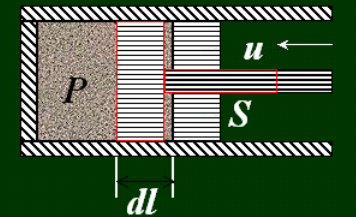
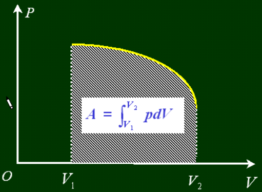

# 9 热力学定律

## 9.1 热力学第一定律

### 9.1.1 准静态过程
之前所讲的物理规律都是在静态的状态成立的，但是系统的状态一旦发生改变，系统就会处于非平衡态。非平衡态到平衡态的过渡时间就是弛豫时间，如果实际每一次压缩所用的时间都大于弛豫时间，那么压缩过程中就几乎随时接近平衡态。

对于一个准静态过程，压强 $p$ 和体积 $V$ 都是确定的值，在 $p-V$ 图上为实线；对于非静态过程，在 $p-V$ 图上为虚线。

### 9.1.2 功、内能和热量
#### 准静态过程做功

规定$\delta A>0$为系统对外做功，$\delta A<0$为外界对系统做功。

那么图中：

$$
\delta A = -F dl = -psdl = pdV
$$
那么
$$
\delta A = pdV
$$
$$
A=\int_{V_1}^{V_2}pdV
$$

系统所做的功在数值上等于$p-V$图上过程曲线以下的面积。

#### 内能

#### 热量

### 9.1.3 热力学第一定律
pass
### 9.1.4 热力学第一定律的应用
pass
### 9.1.5 循环过程和热机的效率
pass

## 9.2 热力学第二定律

### 9.2.1 热力学第二定律
pass
### 9.2.2 可逆过程和不可逆过程
pass
### 9.2.3 卡诺定理
pass
### 9.2.4 熵
pass
### 9.2.5 熵增加原理
pass
### 9.2.6 玻尔兹曼熵
pass